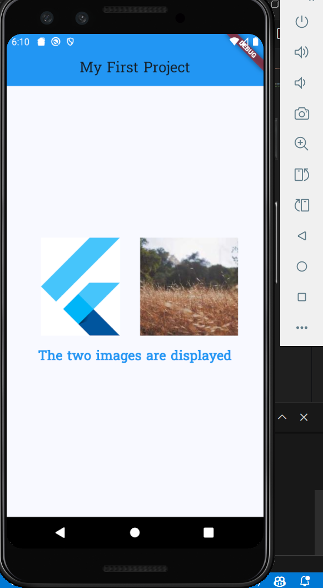

# Flutter Demo App

This is a simple Flutter application that demonstrates various Flutter widgets and features, such as:

- Displaying local and network images.
- Custom fonts applied globally across the app.
- A structured layout with `Column` and `Row` widgets for alignment.

## Features

- **Custom Font**: The `Suwannaphum` font is applied globally.
- **Image Display**: Displays both a local asset image and an image from the network.
- **Responsive Layout**: Widgets are aligned using `Row` and `Column` with padding and centering.

## Getting Started

### Prerequisites

- Ensure you have Flutter installed.

### Installation

1. Clone the repository.
2. Fetch dependencies:
```
flutter pub get
```
3. Run the app:
```
flutter run
```
### Assets Configuration

The app uses a local image asset (`assets/image.png`). Ensure the following:

1. The image is placed in the `assets/` directory within your project.
    
2. The `pubspec.yaml` file includes the image asset:
```
flutter: 
	assets:
		- assets/image.png
```
### File Structure

- **`main.dart`**:
    
    - Entry point of the app.
    - Sets up the `MaterialApp`, custom theme, and font.
    - Points to the home screen (`MyHomePage`).
- **`home_page.dart`**:
    
    - Implements the main screen with the following:
        - An app bar with a centered title.
        - A `Column` containing:
            - A `Row` displaying a local image (`image.png`) and a network image.
            - A `Text` widget describing the images.

## Output Screenshot
